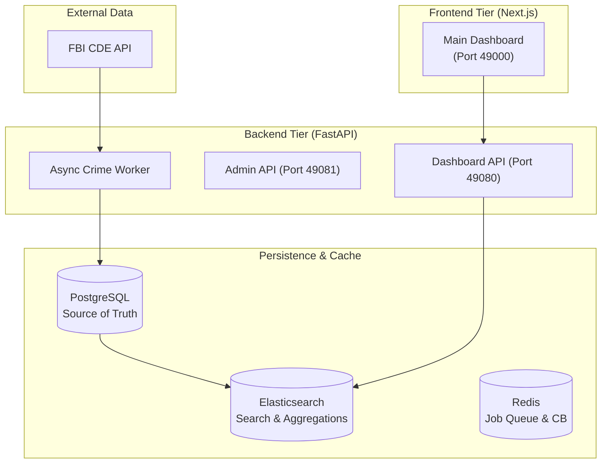

# 🚨 FBI Crime Data Pipeline v2.0
> **Mission-Critical Analytics for National & Regional Crime Trends**

[](https://www.docker.com/) 
[](https://nextjs.org/)
[](https://fastapi.tiangolo.com/)
[](https://opensource.org/licenses/MIT)

A production-grade, asynchronous data pipeline engineered to extract, enrich, and visualize 5+ years of FBI crime statistics. Version 2.0 introduces full-stack containerization, optimized search indices, and a streamlined developer workspace.

---

## 🏗️ System Architecture



---

## ✨ Release v2.0 Highlights

- **🚀 49k Port Series**: Standardized unified port mapping for all services.
- **🧱 Full Containerization**: One-command deployment for the entire stack.
- **🔍 Elastic Analytics**: Real-time aggregation of crime rates per 100k residents.
- **🧹 Optimized Workspace**: Consolidated dev tools and a cleansed root directory.
- **📱 Responsive UI**: Enhanced dashboard with adaptive typography and right-aligned stats.

---

## 🛠️ Project Geography

```
├── backend/            # Python FastAPI Backend
│   ├── api/            # Production API Routes
│   ├── config/         # System & Offense Configurations
│   ├── src/            # Core Engine (Circuit Breakers, Workers)
│   ├── scripts/        # Data Lifecycle (Seeding, Pilots)
│   └── tools/          # Dev & Maintenance Toolbox
├── frontend/           # Next.js Analytics Dashboard
│   ├── src/components/ # Modern, responsive UI components
│   └── src/lib/        # Type-safe API client & shared utils
├── k8s/                # Kubernetes Deployment Manifests
└── rebuild.ps1         # Unified Automation Script
```

---

## 🚀 Getting Started

### 1. Environmental Setup
```powershell
cp .env.example .env
# Important: Update FBI_API_KEY and DATABASE_URL
```

### 2. Launch the Ecosystem
Our Version 2 logic utilizes a unified rebuild script that handles infrastructure, migrations, and builds:
```powershell
./rebuild.ps1
```

### 3. Verification
Access your unified dashboard at:
👉 **[http://localhost:49000](http://localhost:49000)**

---

## ☁️ Deployment Guides

Ready to take your data pipeline to the cloud? Choose your provider below for detailed, container-optimized instructions:

- [**Amazon Web Services (AWS)**](docs/deployment-aws.md) - Using RDS and App Runner.
- [**Google Cloud (GCP)**](docs/deployment-gcp.md) - Using Cloud Run and Cloud SQL.
- [**Microsoft Azure**](docs/deployment-azure.md) - Using App Service and Flexible Server.
- [**Free & Alternative Platforms**](docs/deployment-free-tiers.md) - Oracle Cloud, Render, Fly.io.

---

## 🔧 Developer Toolbox (`backend/tools/`)

We maintain a suite of specialized tools for deep-dive diagnostics:

| Tool | Purpose |
|------|---------|
| `check_agencies.py` | Validates data coverage across state/national Oris. |
| `migrate_summary.py`| Propagates raw data into high-performance summary tables. |
| `debug_db.py` | Diagnoses connectivity and schema health. |
| `debug_fbi_api.py` | Direct FBI API diagnostic bridge. |

---

## 🤝 Credits & Acknowledgments

- **Data Source**: [FBI Crime Data Explorer (CDE)](https://cde.ucr.cjis.gov/).
- **Engineered by**: The Antigravity Team.
- **Special Thanks**: To our contributors who helped refine the v2.0 architecture and port strategy.

---

> [!NOTE]
> **Looking for Version 1?** You can access the legacy snapshot via the `v1-archive` branch or tag. Version 2.0 is the recommended path for production-intent deployments.
